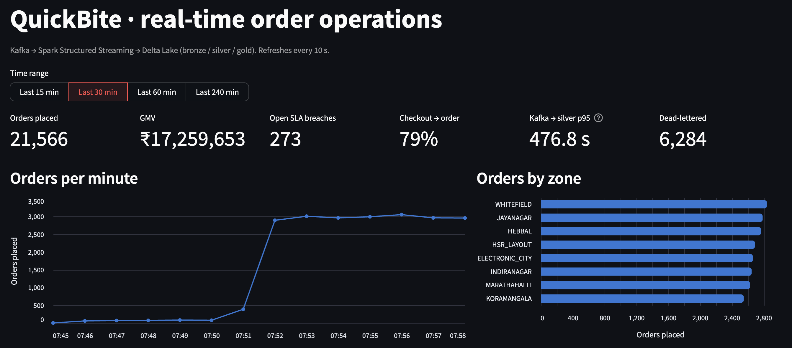
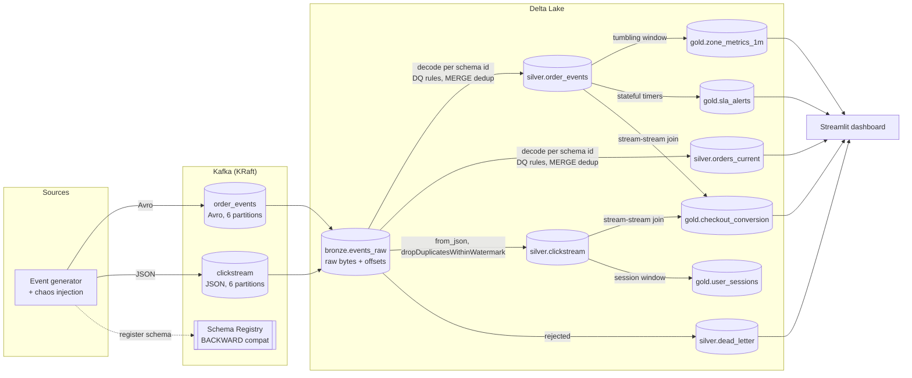
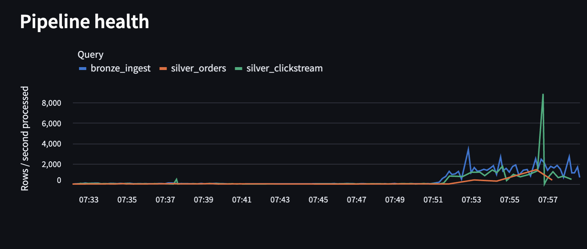
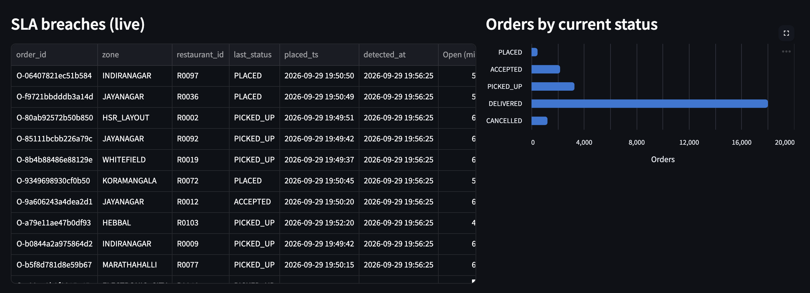
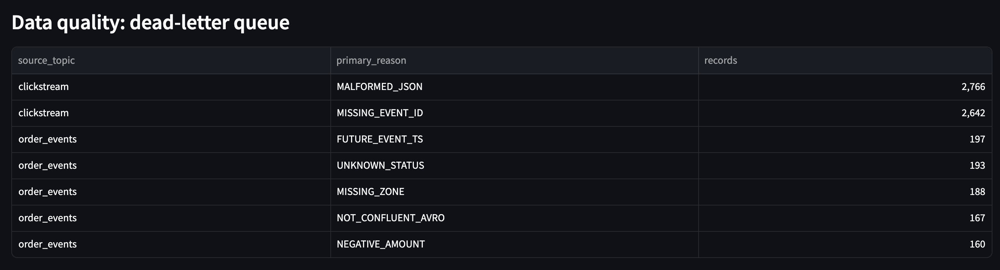
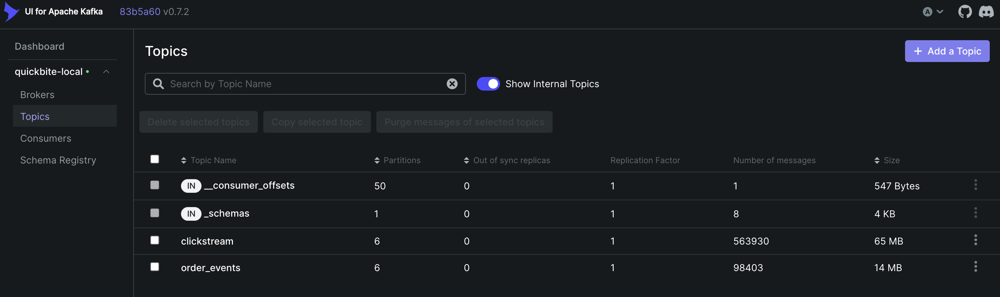

# QuickBite: Real-Time Order & Clickstream Lakehouse

A production-style streaming data platform for a fictional food-delivery app.
Order and clickstream events flow through **Kafka** (with **Schema Registry**) into a
**Delta Lake** medallion architecture built with **Spark Structured Streaming**. The
platform detects SLA breaches as they happen, measures checkout conversion with a
stream-stream join, and survives the failures real event streams have:
duplicates, late and out-of-order events, malformed records, schema changes and
job crashes.

Everything runs locally with one command, and correctness is **verified**, not
claimed: a ground-truth manifest from the generator is reconciled against the
lakehouse after chaos drills.




---

## Architecture



| Layer | Job | What it guarantees |
|---|---|---|
| **Bronze** | `pipeline/jobs/bronze_ingest.py` | Every Kafka record lands byte-for-byte with its topic/partition/offset, exactly once. Silver and gold can always be rebuilt from it. |
| **Silver** | `pipeline/jobs/silver.py` | Decoded, validated, de-duplicated events. Bad records go to a dead-letter queue with reasons, never silently dropped. Current order state is out-of-order safe. |
| **Gold** | `pipeline/jobs/gold.py` | Business-ready streaming aggregates: per-zone metrics, live SLA alerts, checkout conversion, user sessions. |

## Streaming concepts implemented

| Concept | Where | Why it matters |
|---|---|---|
| Exactly-once Kafka → Delta | `bronze_ingest.py` | Offsets in the checkpoint and batch ids in the Delta log commit together, so a crash never loses or duplicates data |
| Idempotent `foreachBatch` | `silver.py` → `process_order_batch` | Delta `txnAppId`/`txnVersion` plus insert-only MERGE mean a retried micro-batch gives the same result |
| Schema Registry + schema evolution | `schemas/`, `avro_decode.py` | v1 → v2 rollout mid-stream; each record is decoded with its own writer schema and aligned to the latest shape |
| Compatibility guardrail | `scripts/check_schema_compat.py` | A breaking v3 schema is rejected by the registry before it can reach the topic |
| Dead-letter queue | `silver.dead_letter` | Undecodable bytes, unknown schema ids and DQ failures are kept with *all* violation reasons and the raw payload |
| Two de-duplication strategies | `silver.py` | MERGE on `event_id` (orders, unbounded horizon) vs `dropDuplicatesWithinWatermark` (clicks, bounded state) |
| Out-of-order safe upsert | `upsert_orders_current` | A late `PICKED_UP` can never overwrite `DELIVERED`: status only moves forward |
| Event-time windows + watermarks | `gold.zone_metrics_1m` | Late events inside the watermark are counted, later ones are dropped *and measured* |
| Arbitrary stateful processing | `state/order_sla.py` | `applyInPandasWithState` with event-time timers fires an alert when something *doesn't* happen |
| Stream-stream outer join | `gold.checkout_conversion` | Time-bounded join on both watermarks; abandoned checkouts emitted once they can no longer convert |
| Session windows | `gold.user_sessions` | Sessions derived from inactivity gaps, not trusted from the client |
| Back-pressure | `maxOffsetsPerTrigger`, `maxFilesPerTrigger` | A backlog after downtime drains in bounded batches |
| RocksDB state store | `spark_session.py` | Large streaming state lives off the JVM heap, with changelog checkpointing |
| Observability | `metrics.py` | A `StreamingQueryListener` records throughput, batch latency, state size and late-row drops for every batch |
| Table maintenance | `jobs/maintenance.py` | OPTIMIZE, Z-ORDER and VACUUM for the small-file problem streaming creates |
| Replay / backfill | `scripts/reset_layers.py` | Silver and gold rebuilt from bronze, with the same results |

---

## Quick start

### Prerequisites

- **Docker Desktop** (or Docker Engine + Compose v2) with **at least 6 GB of memory** allotted
  (Docker Desktop → Settings → Resources). 8 GB is comfortable.
- **make** (on macOS and Linux it's already there; on Windows use WSL2, or run the `docker compose` commands shown in the `Makefile` directly).
- ~5 GB of free disk space for images.

### Run it

```bash
git clone https://github.com/SubashDevarajan/quickbite-realtime-lakehouse.git
cd quickbite-realtime-lakehouse
make up
```

The first build takes 5–10 minutes: it downloads Spark and pre-fetches the Delta, Kafka
and Avro jars into the image. After that, startup takes about a minute.

| URL | What you'll see |
|---|---|
| http://localhost:8501 | Live dashboard: orders/min, GMV, open SLA breaches, conversion, latency, DLQ, pipeline health |
| http://localhost:8080 | Kafka UI: topics, partitions, consumer lag, and the decoded Avro messages |
| http://localhost:8081/subjects | Schema Registry: `order_events-value` gets version 2 about 90 s after start |

What to expect over time:

| After | You'll see |
|---|---|
| ~30 s | Bronze and silver counts growing (`make logs`) |
| ~3 min | First 1-minute windows on the dashboard (the window must close, then the 2-minute watermark must pass) |
| ~10 min | First SLA breaches from stuck orders (4-min SLA in the demo, plus the 5-min alert watermark) |

Useful commands:

```bash
make ps               # container status
make logs             # follow bronze/silver/gold logs (per-batch rows, throughput, late drops)
make sql              # PySpark shell with every table registered as a view
make down             # stop, keep data
make clean            # stop and delete ALL data
make help             # everything else
```

## Drills (the interesting part)

Each drill ends with `make verify`, which stops the generator, waits for the pipeline to
drain, and reconciles the lakehouse against the generator's ground-truth manifest:

```
RESULTS
  [PASS] no duplicate order events in silver              rows=2042 distinct_event_ids=2042
  [PASS] no duplicate click events in silver              rows=11805 distinct_event_ids=11805
  [PASS] orders_current never regressed a status          regressed_orders=0
  [PASS] silver order events == unique valid produced     silver=2042 produced=2042
  [PASS] silver click events == unique valid produced     silver=11805 produced=11805
  [PASS] every malformed order_events record is in the DLQ dlq=17 malformed_produced=17
  [PASS] every malformed clickstream record is in the DLQ dlq=114 malformed_produced=114
```
*(Output after `make chaos-kill-silver`. Counts depend on how long the generator has been running.)*

Run `make resume-generator` after each drill to start producing again.

| # | Drill | Command | What it proves |
|---|---|---|---|
| 1 | **Crash mid-batch** | `make chaos-kill-silver`, then `make verify` | SIGKILL at an arbitrary point, possibly mid-MERGE. On restart the unfinished batch replays; idempotent writes mean no duplicates and no loss |
| 2 | **Backlog / back-pressure** | `make chaos-pause-silver` | Silver is frozen for 3 min while bronze keeps ingesting. On resume it catches up in bounded batches (watch `num_input_rows` in `make logs`) |
| 3 | **Replay from bronze** | `make replay`, then `make verify` | Silver and gold are deleted and rebuilt from raw data with identical results. This is how you ship a bug fix or a new DQ rule |
| 4 | **Schema evolution** | `make schema-check` | The registry accepts v2 (optional field added) and rejects v3 (field renamed, required field added) |
| 5 | **Load test** | `make benchmark` | About 1,200 events/s; read throughput and batch latency on the dashboard's *Pipeline health* panel |
| 6 | **Small files** | `make maintain` | Compacts the thousands of files micro-batches create; logs file counts before and after |

## Results

Measured on a MacBook Air (Docker Desktop, 7.7 GB memory, 10 CPUs), all jobs in Spark local mode.

| Metric | Value | How measured |
|---|---|---|
| Duplicates in silver after SIGKILL mid-batch | **0** | `make chaos-kill-silver`, then `make verify` |
| Records lost after crash | **0** | Silver counts equal the generator's unique valid events |
| Malformed records caught | **100%** (131 / 131) | DLQ vs the generator's manifest |
| Bronze ingestion under load | **~1,200 events/s** sustained | `bronze_ingest` median input rate during `make benchmark` |
| Small files compacted | **1,700 → 10** across 9 tables | `make maintain` log |

Under the benchmark load, bronze kept up while `silver_orders` became the bottleneck: its
per-batch `MERGE` grew to over a minute and the backlog drained in bounded batches once the
load dropped. See [design decisions](docs/design-decisions.md#trigger-interval) for the latency trade-offs.



### Screenshots

All taken during `make benchmark`, which is why Kafka → silver latency on the dashboard
is high: silver was working through a backlog.

| | |
|---|---|
| **Live SLA breaches and order status** |  |
| **Dead-letter queue by reason** |  |
| **Kafka topics (Kafka UI)** |  |

---

## Data model

**Order event** (Avro, `schemas/order_event_v2.avsc`): `event_id`, `order_id`,
`customer_id`, `session_id`, `restaurant_id`, `zone`, `status`, `amount` (decimal),
`event_ts` (timestamp-millis), `payment_method` (v2).

Lifecycle: `PLACED → ACCEPTED → PICKED_UP → DELIVERED`, or `PLACED → CANCELLED`.
About 3% of orders get stuck (they trigger SLA alerts).

**Click event** (JSON): `event_id`, `session_id`, `customer_id`, `event_type`
(`app_open | search | view_restaurant | add_to_cart | checkout_started`), `restaurant_id`,
`zone`, `device`, `event_ts`.

**Injected chaos** (`generator/chaos.py`, all rates configurable):

| Fault | Default rate | Expected handling |
|---|---|---|
| Duplicate (same `event_id`) | 3% | Removed in silver |
| Late / out of order (30 s–4 min) | 3% | In silver always; in windows if within the watermark |
| Malformed (garbage bytes, bad status, negative amount, future timestamp, empty zone, broken JSON, missing id) | 1% | Dead-letter queue with reasons |
| Stuck order | 3% of orders | `SLA_BREACH` alert |

## Tables

| Table | Grain | Partitioned by | Write pattern |
|---|---|---|---|
| `bronze/events_raw` | one Kafka record | `topic`, `ingest_date` | streaming append |
| `silver/order_events` | one unique event | `event_date` | insert-only MERGE on `event_id` |
| `silver/orders_current` | one order | – (Z-ORDER `order_id`) | forward-only MERGE |
| `silver/clickstream` | one unique click | `event_date` | append after watermark dedup |
| `silver/dead_letter` | one rejected record | `detected_date` | idempotent append |
| `gold/zone_metrics_1m` | zone × minute | – | append (finalised windows) |
| `gold/sla_alerts` | alert | – | append |
| `gold/checkout_conversion` | checkout | – | append (after join resolves) |
| `gold/user_sessions` | derived session | – | append (after session closes) |

## Project layout

```
├── generator/            # simulator (pure Python), chaos injection, Kafka producer
├── schemas/              # Avro schemas: v1, v2, and a deliberately breaking v3
├── pipeline/
│   ├── jobs/             # bronze_ingest, silver, gold, maintenance entry points
│   ├── avro_decode.py    # Confluent wire format + per-schema-id decoding
│   ├── quality.py        # data-quality rules as Spark expressions
│   ├── silver.py         # silver transforms + idempotent Delta writes
│   ├── gold.py           # windows, stateful SLA, stream-stream join, sessions
│   ├── state/order_sla.py# SLA state machine (pure Python) + Spark adapter
│   ├── metrics.py        # StreamingQueryListener → JSONL
│   └── tables.py         # explicit Delta table schemas
├── dashboard/app.py      # Streamlit, reads Delta via delta-rs (no Spark)
├── scripts/              # verify, replay, schema check, SQL shell, topic setup
├── tests/                # pytest: pure-Python + Spark/Delta tests
├── docs/                 # design decisions, runbook
├── docker/               # Dockerfiles
├── docker-compose.yml
└── Makefile
```

## Running the tests

CI runs everything on each push (`.github/workflows/ci.yml`). Locally:

```bash
python -m venv .venv && source .venv/bin/activate   # Windows: .venv\Scripts\activate
make install-dev
make test-fast     # pure-Python tests: simulator, chaos, SLA state machine (no Java needed)
make test          # everything, including Spark + Delta tests (needs Java 17 on PATH)
```

The Spark tests run real Delta MERGEs against temp directories and cover:
- multi-version Avro decoding,
- every DQ rule,
- duplicate removal within and across batches,
- idempotent batch retries,
- out-of-order state updates,
- the gold transformations.

## Running on a cloud cluster

The jobs are plain PySpark with no Docker-specific code. To run them on Databricks or any
Spark 3.5 cluster, point the configuration at real infrastructure:

```bash
LAKE_ROOT=abfss://lake@<account>.dfs.core.windows.net/quickbite   # or gs://..., s3a://...
KAFKA_BOOTSTRAP=<confluent-cloud-or-event-hubs-endpoint>:9092
SCHEMA_REGISTRY_URL=https://<registry>
```

On Databricks, prefer Unity Catalog tables over paths, and a Databricks Workflow per job
with its own checkpoint. Kafka SASL settings go in `bronze_ingest.py`'s reader options.

## Further reading

- [docs/design-decisions.md](docs/design-decisions.md): every major trade-off, and what I'd change at 100× scale
- [docs/runbook.md](docs/runbook.md): failure scenarios, symptoms, and recovery steps
